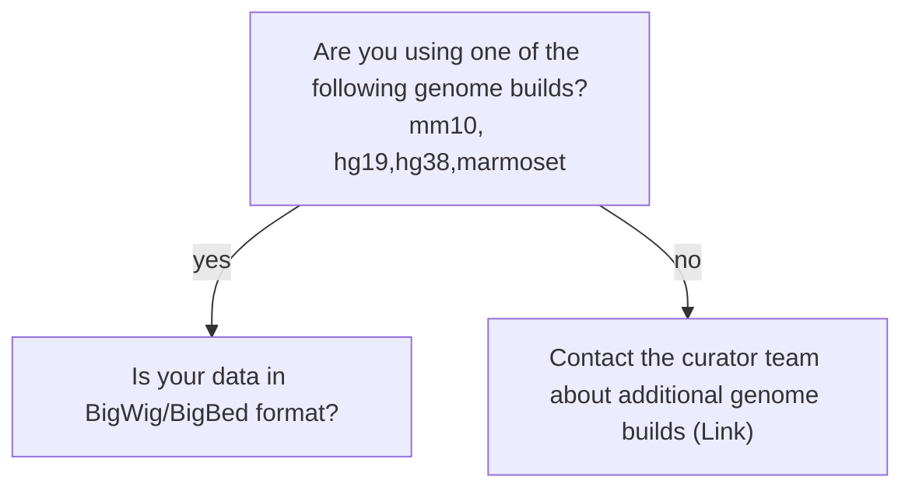

```mermaid
graph TD

  A[Are you using one of the <br/>following genome builds?<br/>mm10, hg19,hg38,marmoset]
  A-->|yes|B[Is your data in BigWig/BigBed format?]
  A-->|no|C["Contact the curator team about additional genome builds (Link)"]

  
  
  
  click B "https://umgear.org/upload_epigenetic_data.html" "Link to Epigenetic upload" _blank
  click C "https://umgear.org/contact.html" "Link to contact form" _blank
 


```
